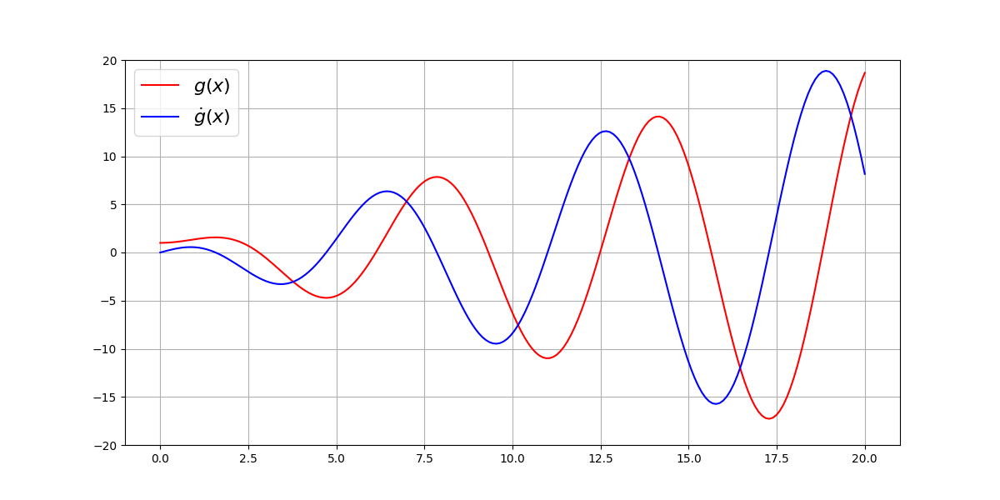
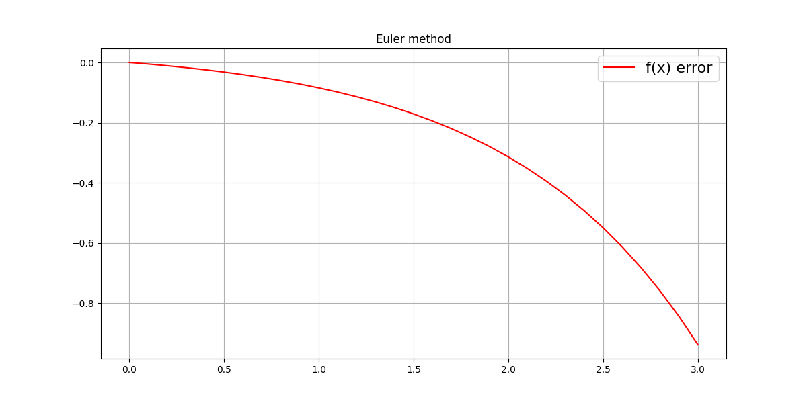

+++
date = '2025-02-16T00:23:50-06:00'
draft = true
title = 'Numerical ODE methods for simulation'
description = 'Practical numerical methods for solving ODEs in terms of precise and efficient motion simulation.'
math = true
+++

## Abstract
For developing and learning control algorithms, simulation has become a crucial part. When system dynamics are known,
the simulation can be reduced to solving [ordinary differential equations](https://en.wikipedia.org/wiki/Ordinary_differential_equation) (ODEs).
Since analytical solutions are often unavailable or complex, numerical methods are used.
This note focuses on practical numerical methods for solving ODEs in terms of precise and efficient motion simulation.

## Problem statement
Let's consider a continuous state system evolving in continuous time, e.g. a [simple pendulum](https://en.wikipedia.org/wiki/Pendulum_(mechanics)).
The state of such system can be written as vector $s = [\theta, \dot{\theta}]^T$, where $\theta$ is the angle of the pendulum.
Assuming no friction, the equation of motion can be written as:

$$
\begin{equation*}
  \dot{s} = f(s, t) =
  \begin{bmatrix}
    \dot{\theta} \\\\
    \ddot{\theta}
  \end{bmatrix}
  = \begin{bmatrix}
    \dot{\theta} \\\\
    -\frac{g}{l} \sin(\theta)
  \end{bmatrix}
\end{equation*}
$$

So, simulation can be reduced to solving the ODE $\dot{s} = f(s, t)$ with initial condition $s(t_0) = s_0$.
In practice, simulation is performed in discrete time steps with small intervals.
The state at time $t_{i+1}$ can be approximated using the state at time $t_i$.

$$
\begin{equation*}
  s(t_{i+1}) = s(t_i) + \int_{t_i}^{t_{i+1}} f(s(\tau), \tau) d\tau
\end{equation*}
$$

As you can see, even such a simple mechanical system as a pendulum doesn't have analytical solution. So, we need more examples to evaluate  methods. Let's consider a pair of simple first-order ODEs with known analytical solutions:
$$
\begin{align*}
  \dot{f}(x) &= \exp(x) \\\\
  f(x) &= \exp(x)
\end{align*}
$$

$$
\begin{align*}
  \dot{g}(x) &= x \cdot \cos(x) \\\\
  g(x) &= x \cdot \sin(x) + \cos(x)
\end{align*}
$$

## Explicit Euler method

The simplest method for solving ODEs is the explicit Euler method. It can be derived in several ways  (rectangular integration rulle, geometric interpretation, Taylor series expansion, etc.).

$$
\begin{equation*}
  y_{i+1} = y_i + h \cdot f(y_i, t_i)
\end{equation*}
$$

where $h$ is the time step. On plot below you can see error for $f(x)$, $h = 0.1$, as you can see, error is sightly increasing with time.

## Runge-Kutta method

The Runge-Kutta method is a family of implicit and explicit iterative methods, which include the well-known routine called the Euler Method, used in temporal discretization for the approximate solutions of ordinary differential equations. The method is derived from the Taylor series expansion:

$$
\begin{align*}
  y(t + h) = y(t) + &h \cdot f(t, y) + \frac{h^2}{2} \cdot f^{(1)}(t, y) + \ldots \\\\ &\frac{h^3}{6} \cdot f^{(2)}(t, y) + \frac{h^4}{24} \cdot f^{(3)}(t, y) + o(h^5)
\end{align*}
$$

As you can see, explicit Euler method is also follow from this expansion, with $o(h^2)$ error.
Let's get equation for RK2 method:

$$
\begin{align*}
  y_{i+1} &= y_i + h \cdot f(y_i + \frac{h}{2} \cdot f(y_i, t_i), t_i + \frac{h}{2}) \\\\
  y_{i+1} &= y_i + h \cdot f(y_i + \frac{h}{2} \cdot f(y_i, t_i), t_i + \frac{h}{2})
\end{align*}
$$
